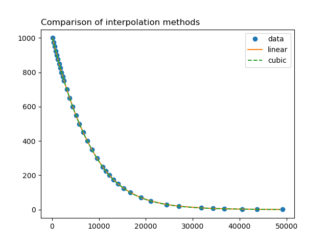
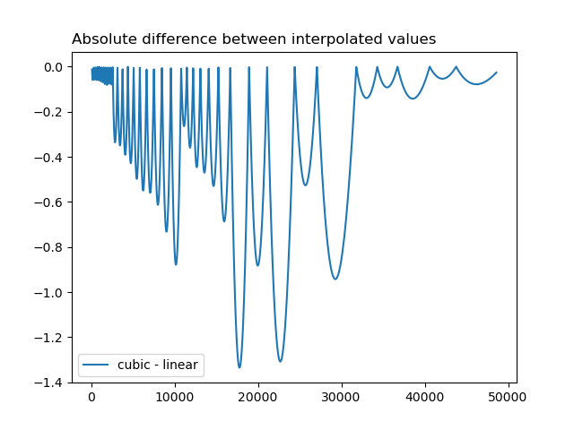
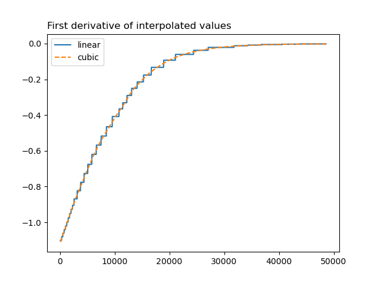
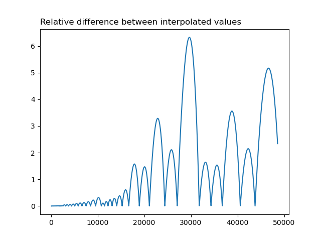

# Reading GRIB input

## Data interpolation

Values of GRIB data are interpolated using pseudo-tricubic method.

Initially, trilinear interpolation was used, but lack of continuous derivative of interpolated
values was suboptimal. Derivative of pressure is at the center of adiabatic and pseudo-adiabatic
schemes so discountinueties negatively impact this scheme. Also, ECMWF switched to cubic interpolation
in their IFS model as it is preferred [1](https://confluence.ecmwf.int/display/FCST/Implementation+of+IFS+Cycle+47r3#ImplementationofIFSCycle47r3-Observations).

As meteorological quantities have mostly constant monotonicity and rather mild gradients
there is no need for using the monotone limiter, which simplifies the implementation.

The used method is pseudo-tricubic as it does not interpolates values
using one three-dimensional function but using a sequence of three one-dimensional functions.
The result is effectively the same as real tricubic, but much easier to implement and of
comparable performance.

Comparison of methods      |  Differences between methods
:-------------------------:|:-------------------------:
   |  
   |  
